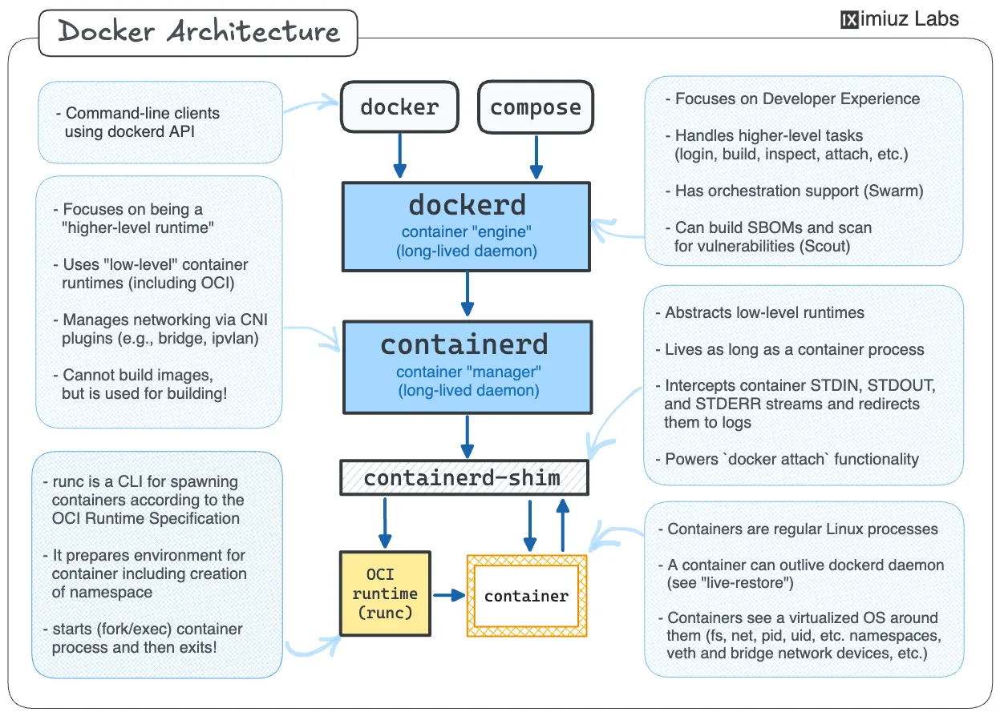

### What is docker?

`Docker` is a tool that provides reproducible environments for applications

> Docker helps developers build, share, run, and verify applications anywhere — without tedious environment configuration or management.

---

### Problem and how docker solves the issue

1. “Works on my machine” syndrome everywhere. -> reproducibility from a image config.

> `Works on my machine` usually happens due to version mismatch, environment inconsistencies, platform dependencies and so on.

---

### Key terminologies

1. Image - a `read-only` blueprint/template(like `class` in `OOPs` languages).
2. Container:
   - actual entity from the blueprint.
   - actual running instance of a template.
   - like `object` in `OOPs` languages.
   - it contains your application, all its dependencies, runtime environment.
3. Dockerfile:
   - Instruction on building the image.
   - contains `base image/os, dependencies, commands, startup process`.
4. Registry:
   - A place to store the images.
   - Like `github` for repos, but for docker images.
   - Ex: [docker hub](hub.docker.com)

---

### Virtual Machines(VM) vs Docker

| VM                | Docker Container   |
| ----------------- | ------------------ |
| Full OS per VM    | Shares host kernel |
| Heavy             | Lightweight        |
| Slow boot         | Fast startup       |
| GBs in size       | MBs usually        |
| Hypervisor needed | Docker Engine      |

---

### Hypervisor

- `Hypervisor` is a software that allows multiple virtual machines(VM) run on a single physical computer.
- It virtualizes hardware, allocates resources, isolates host OS, manage VM execution.
- Each VM gets its own kernal, os, virtual hardware.

### Types of Hypervisors

- `Type 1`: runs on bare metal.
- `Type 2`: runs on another `OS`.

---

### Docker engine

- allows bundling, packaging, execution of a docker container.
- Ex: `dockerd`, `docker cli`
- since, docker container runs on the `OS host kernal`, `docker engine` usually works with process isolation(like `sandbox`).

---

### What is an base image and is it required?

A base image gives your container a starting filesystem + runtime environment. It usually includes a `shell`, `filesystem`, `binaries`, `runtime`, `libraries`, `package manager(if included)`.

> NOTE: we can create a docker image without any base image, by using `FROM scratch` keyword, usually when working with a statically compiled language(simply to execute the binary directly).

---

### Limitations of Docker Runtime

- Containers share the host kernel instead of running their own full OS.
- Because of this, containers are limited by the host OS kernel compatibility.

#### Native Compatibility

- Linux containers run natively on Linux.
- Windows containers run natively on Windows.

#### macOS / Windows Case

- On macOS and Windows, `Docker Desktop` creates a lightweight Linux VM internally.
- Docker containers actually run inside that Linux VM.
- This allows Linux-based images to run on:
  - Linux
  - Windows
  - macOS

#### Important Limitation

- Since Linux containers depend on the Linux kernel:
  - Linux containers cannot run directly on non-Linux kernels.
- Similarly:
  - Windows containers require the Windows kernel.
  - Windows containers cannot run natively on Linux/macOS.

#### Simple Mental Model

```text
Linux Container  -> Needs Linux Kernel
Windows Container -> Needs Windows Kernel
```

---

### Docker installation

- Visit [docker home page](https://www.docker.com/)
- click on `download docker desktop` to get both `CLI` and `GUI`.
- select your respective `OS` and install it.
- verify docker installation status with:
  - `docker --version` command in the terminal.

---

### basic docker commands

- `docker pull <image-name>` -> pulls a specific image from the `registry`.
- `docker pull <image-name>:<tag>` -> pulls a specific version of a specific image from the `registry`.
- `docker images` -> list all docker images in the system. Once a docker image is pulled, it stays in the computer, until it is removed.
- `docker run <image-name>`:
  - to create a new container of the image and runs it in attached mode(unless specified with detached mode).
  - It always creates a new container, even already exists for the image.
  - if the images not exists, it pulls from the registry and run it.
- `docker run --name <container-name> <image-name>` -> assigns a custom name to the container instead of random unique one.
- `docker ps` -> shows all running containers only.
- `docker ps -a` -> shows all containers(running + stopped).
- `docker logs <container-name/id>` -> shows the logs of the container with id or name in the `stdout`.
- `docker run -it <image-name>`:
  - `i` -> interactive mode.
  - `t` -> allocates `pseudo TTY(terminal)`.
  - Docker's interactive mode allows direct interaction with a running container's shell, enabling real-time command execution and interaction with its file system. This mode is particularly useful for debugging, development, and troubleshooting within a container.
- `Attached Mode`:
  - In attached mode, the container's standard input, output, and error streams are directly connected to your terminal. You see the container's output in real-time in your terminal window.
  - This mode is suitable for interactive tasks, debugging, or applications that require direct user interaction or need to be stopped when the terminal is closed.
  - By default, docker run starts a container in attached mode unless specified otherwise
- `Detached Mode`:
  - In detached mode, the container runs in the background, independent of your terminal session.
  - You do not see the container's output directly in your terminal, and your terminal remains free for other commands.
  - This mode is ideal for services or applications that need to run continuously without requiring immediate attention or user interaction.
  - You typically use the -d or --detach flag with docker run to start a container in detached mode.
- `docker attack <container-name/id>` -> attaching to a detached container with id or image.
  - To detach from a container without stopping it, you typically use the key sequence Ctrl+P followed by Ctrl+Q.
- `docker start <container-name/id>` -> to restart the stopped container with id or image.
- `docker stop <container-name/id>` -> to stop the running container with id or image.
- `docker rmi <image-name>` -> remove unused image to save disk space.
- `docker rm <container-name>` -> remove unused container to save disk space.
- `docker image prune` -> removes all unused images.
- `docker container prune` -> removes all unused containers.
- `docker exec -it <container-name/id>` -> runs commands on the running container with id or name and show the output in `stdout`.

---

### Dockerfile and how to use it?

`Dockerfile` contains template on the docker image. it usually contains application logic, environment, dependencies and startup command.

> `Dockerfile` usually works on the principle of layering. i.e. creating a new image on top of another image.

---

### Sample Dockerfile and it's explanation

```Dockerfile
# lightweight base image
FROM node:10-alpine

# working directory inside container
# all upcoming commands will be executed from here
WORKDIR /app

# copy dependency/configuration files first
# this helps docker layer caching
# installation steps rerun only if these files change
COPY package*.json ./

# run commands during image build time
# usually used for installing dependencies/setup
RUN npm install

# copy remaining source code/files
# files inside .dockerignore are excluded automatically
COPY . .

# declare the port used by the application
# this is only metadata/documentation
# actual port mapping should be done while running
EXPOSE 8080

# default startup command for container
CMD ["node", "app.js"]
```

> After creating a `Dockerfile` run:
> `docker build -t <tag-name> .` -> to build it.

---

### Port Mapping

- docker containers runs on isolated environment(docker engine is responsible for process isolation).
- but sometimes our other external application may be need to communicate with the docker container instance.
- to address this issue we use a concept called `port mapping`.

```sh
docker run -p <host-port>:<container-port> <image-name>
```

---

### volumes

- since, docker runs in a isolated environment, usually data from native system to the container or data from one container to another container can't be shared.
- to address this issue, allowing data persistance, we use a concept called `volumes`.

```sh
docker run -v <host-path>:<container-path> <image-name>
```

- `docker volume create <volume-name>` -> creates a new volume.
- `docker volume ls` -> list docker volumes.
- `docker volume inspect <volume-name>` -> inspect docker volume.
- `docker volume rm <volume-name>` -> remove a docker volume.

---

### What is `docker-compose` and why is it needed?

- A real world application usually contains many services such as, frontend, backend, database.
- each service depends on various others like frontend depends on backend, while backend depends on database.
- so it is hard to scale effectively.
- also for each service to connect with one another we need a manual network setup using docker.
- manual process are error prone and hard to scale effectively.
- docker compose is way to write on how different services interact and depends on each other and takes care of it automatically.

---

### Sample `docker-compose.yml` and it's explanation

```yaml
# version name
version: "1.0"

services:
  # frontend application
  frontend:
    build: ./frontend

    # expose frontend to host machine
    ports:
      - "5173:5173"

    # frontend should start after backend
    depends_on:
      - backend

  # backend application
  backend:
    build: ./backend

    # expose backend api to host machine
    ports:
      - "8080:8080"

    # environment variables for backend
    environment:
      MONGO_URL: mongodb://database:27017/app

    # backend should start after database
    depends_on:
      - database

  # mongodb database service
  database:
    image: mongo

    # persist database data using volumes
    volumes:
      - mongo-data:/data/db

    # expose database port (optional for local debugging)
    ports:
      - "27017:27017"

# named volume managed by docker
volumes:
  mongo-data:
```

---

### Docker architecture



---

### References

- [Docker docs official](https://docs.docker.com)
- [Linkedin docker notes](https://www.linkedin.com/pulse/complete-docker-notes-from-basics-advanced-amit-pandey-97e0f/)
- [Github cheatsheet](https://github.com/khalid-el-masnaoui/docker-notes) -> contains useful info about commands and it's flags.
